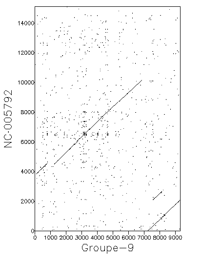
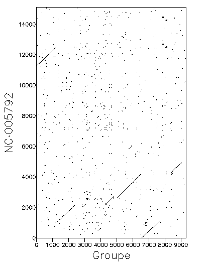
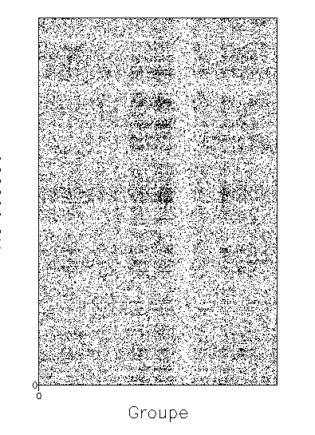
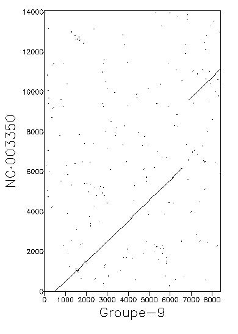
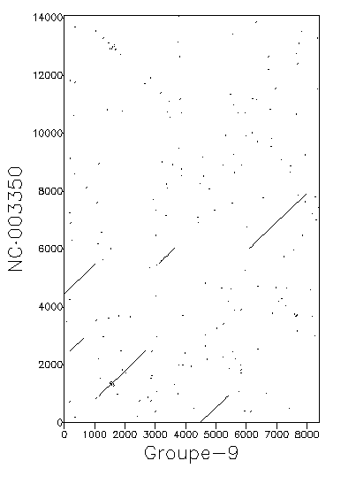
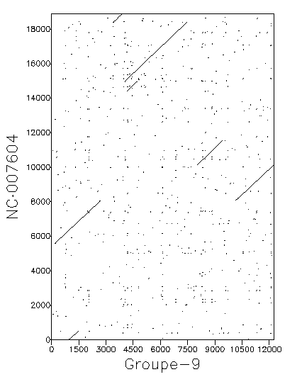

# Rapport du projet de bio-informatique

Rapport du projet de bio-informatique réalisé par [Aline
Goeminne](https://github.com/AlineGoeminne) et [Danny
Willems](https://github.com/dannywillems).

## Comment compiler

Un makefile est fourni pour simplifier la compilation des fichiers tex.

* **make**: compile le fichier et génère un pdf.
* **make clean**: supprime les fichiers générés pendant la compilation en pdf
  mais garde le pdf.
* **make fclean**: supprime tous les fichiers générés pendant la compilation et
  supprime pdf.
* **make zip**: compile, clean et créer un dossier zip avec le pdf généré, le
  Makefile et les sources.

## Structure du dépot

```
README.md            // Ce fichier
Makefile
src                  // Dossier contenant les fichiers tex
|--> rapport.tex     // Fichier tex principal.
```

## Dotmatchers

Liste des résultats du dotmatcher

### Simplifiée

* Cible1S

* Cible1S-ic

* Cible2S

* Cible2S-ic

* Cible3S

* Cible3S-ic


### "Normale"

* Cible1

* Cible1-ic

* Cible2

* Cible2-ic

* Cible4

* Cible4-ic

* Cible5

* Cible5-ic


## Todo

* [ ] Lister les autres essais qu'on a fait.
* [ ] Lister les complexités ?
* [ ] Quand backtrack, on prend quel jmax et quel imax ? Le plus à gauche ou le
  plus à droite ? Le plus en haut ou le plus en bas ?
